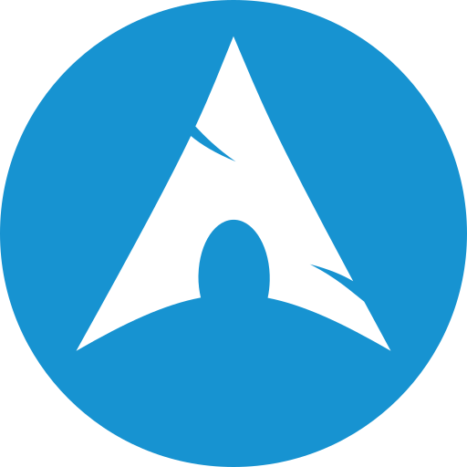

# <h1 align="center">*Hola, Soy Nicolas Burgueño* </h1>
	

  

 
		

 
	<a href="https://www.google.com/"/> Resumen CV	

## 
 *Sobre Mi*

>- 
🌱 Me encuentro aprendiendo --> <b>React Native, TypeScript.</b>

>- 
💬 Me puedes preguntar sobre --> <b>JavaScript,React & Redux,NodeJS,Express,HTML,CSS,PostgreSQL,Sequelize.</b>

>- 
🌄 disfruto explorar el mundo y descubrir nuevos lugares. La diversidad cultural y las experiencias enriquecedoras son una fuente de inspiración para mí, y estoy constantemente buscando formas de incorporar estas experiencias en mi trabajo.

>- 
🙋🏻‍♂ Soy una persona colaborativa y disfruto trabajando en equipo. Valorizo la colaboración y el intercambio de conocimientos con mis compañeros, siempre dispuesto a ayudar y aprender de los demás. Aprecio las críticas constructivas que me ayudan a crecer como profesional y me mantengo en constante aprendizaje para seguir mejorando mis habilidades.

>- 
⚽ Además del desarrollo de software, tengo un gran interés por el fútbol. Jugar y seguir este deporte es una de mis pasiones fuera del ámbito profesional. Creo que la disciplina y la determinación que se requieren en el fútbol se pueden trasladar al mundo del desarrollo de software para lograr resultados excelentes.

>- 
📫 Si estás interesado en conocer más sobre mi trabajo o deseas contactarme para discutir una posible colaboración, no dudes en enviarme un correo electrónico a <b>nicogg08@gmail.com</b> . Estoy emocionado por las oportunidades futuras y ansioso por formar parte de proyectos innovadores.

¡Gracias por tu atención y espero tener la oportunidad de trabajar juntos en un futuro cercano!
 
 

<!-- ---------------------------------------------------------------------------------------------------------------------------------------------------------------------------------------------------------------------- -->

	

<h2 align="left"><b><em>Mis habilidades</em></b>

	

<h2 align="left"><b><em>- Hablidades Blandas</em></b>

<ul>
	<li><b>Scrum</b></li>
	<li><b>Trabajo en equipo</b></li>
	<li><b>Proactivo</b></li>
	<li><b>Resolución de problemas</b></li>
	<li><b>Creatividad</b></li>
	<li><b>Perseverancia</b></li>
	<li><b>Aprendizaje continuo</b></li>
	<li><b>Adaptabilidad</b></li>
</ul>

	

<h2 align="left"><b><em>- Habilidades Tecnicas</em></b>
	
	
###  👉 *Lenguajes de programación* 👨‍💻
	
<table align="center">
  <tr>
    <td align="center" width="96">
      
       JavaScript
    </td>
   <td align="center" width="96">
      
       TypeScript
    </td>
	  <td align="center" width="96">
      
       NodeJs
    </td>
	  <td align="center" width="96">
      
       HTML
    </td>
	<td align="center" width="96">
      
       CSS
    </td>
  </tr>
</table>

###  👉 *Frameworks y Librerias* 🧰

<table align="center">
  <tr>
   <td align="center" width="96">
      
       Express
    </td>
	  <td align="center" width="96">
      
       React
    </td>
	  <td align="center" width="96">
      
       Tailwind CSS
    </td>
	<td align="center" width="96">
      
       Material UI
    </td>
  </tr>
</table>

###  👉 *Bases de datos y Alojamiento en la nube* 🗄️

<table align="center">
  <tr>
   <td align="center" width="96">
      
       Github Pages
    </td>
	  <td align="center" width="96">
      
       Notion
    </td>
	  <td align="center" width="96">
      
       SQLite
    </td>
	<td align="center" width="96">
      
       Vercel
    </td>
	  <td align="center" width="96">
      
       Heroku
    </td>
	  <td align="center" width="96">
      
       MySQL
    </td>
	  <td align="center" width="96">
      
       MongoDB
    </td>
	  <td align="center" width="96">
      
       PostgreSQL
    </td>
  </tr>
</table>
	
###  👉 *Software y Herramientas* 💻

<table align="center">
  <tr>
   <td align="center" width="96">
      
       Android
    </td>
	  <td align="center" width="96">
      
       Discord
    </td>
	  <td align="center" width="96">
      
       Stack Overflow
    </td>
	<td align="center" width="96">
      
       Arch Linux
    </td>
	  <td align="center" width="96">
      
       Git
    </td>
	  <td align="center" width="96">
      
       VS Code
    </td>
	  <td align="center" width="96">
      
       Postman
    </td>
	<td align="center" width="96">
      
       Trello
    </td>
  </tr>
</table>

<!-- ---------------------------------------------------------------------------------------------------------------------------------------------------------------------------------------------------------------------- -->
 
<h2><b><em> Conectate conmigo</em></b></h2>

	
	&emsp;
	
	&emsp;
	

 
 

 

<h2 align="left"><b><em>📊 Github Estadisticas</em></b>

	

	&nbsp;
	
	 
 	
	.
	

		

  

  

	
  

    
  

  

 
  &nbsp;
	  
   
  <b>Note:</b> Top languages is only a metric of the languages my public code consists of and doesn't reflect experience or skill level.
  

----

  
<b>⚡ Recent GitHub Activity</b>

   
   
   
<!-- 7oSkaaa -->

 

## :trophy: *Git profile Trophies*

  

-----
Credits: [7oSkaaa](https://github.com/7oSkaaa)

Last Edited on: 10/02/2022

